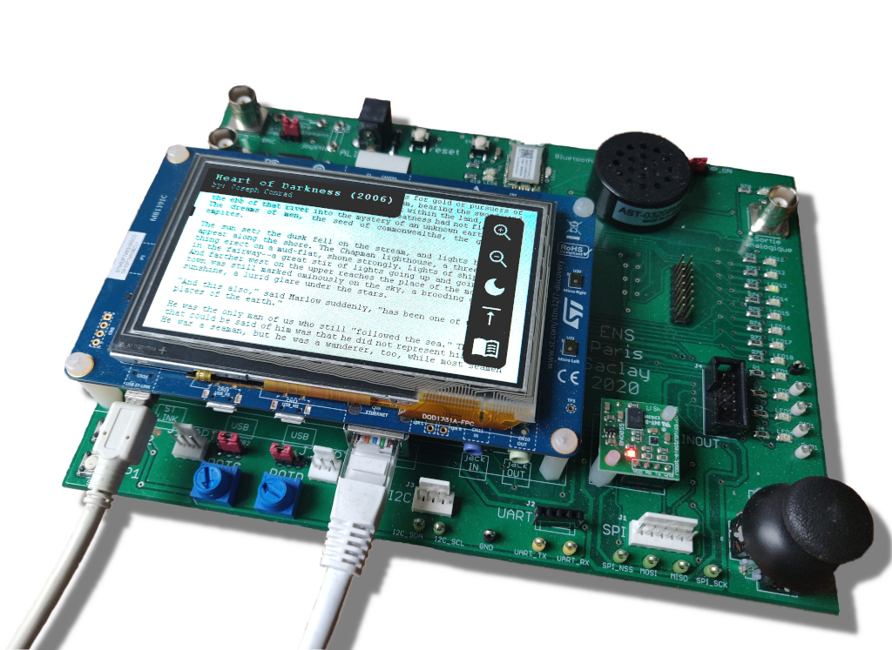

# Mini liseuse numérique

**Réalisé par Quentin Rousset**

## Présentation du projet

Ce projet d'informatique industrielle de l'UE ENS liée au M1 E3A met en place une liseuse numérique connectée sur la carte *STM32746G DISCOVERY*. À l'aide d'une carte SD et d'un câble Ethernet, cette application permet de télécharger des livres gratuits depuis le site Internet [Gutenberg](https://www.gutenberg.org) et de les stocker dans sa bibliothèque personnelle. Il est ensuite possible de lire n'importe quel livre téléchargé à l'aide de la liseuse intégrée, qui dispose de plusieurs fonctionalités comme un système de zoom, des outils de navigation et enfin de contraste.

La programmation de l'application s'est réalisée en plusieurs étapes. Tout d'abord la création de la liseuse. Puis l'interface de la bibliothèque et le stockage sur carte SD. Et enfin la connexion à Gutenberg ainsi qu'à une [API](http://gutendex.com) permettant de télécharger un index des livres disponibles sur la plateforme.

## Fonctionnement global

Les différentes pages de ce site Web expliquent la réalisation de chacune de ces étapes. On y retrouve la stratégie envisagée à chaque fois, les problèmes et limitations rencontrées ainsi que les résultats obtenus et ce qu'il faudrait améliorer. On retrouve ci-dessous les trois grosses parties du projet :

* [Bibliothèque](library)
* [Gutenberg](guten)
* [Lecteur](reader)

Ces trois parties sont reliées entre elles grâce à trois tâches principales dédiées chacune à une composante nécessitant de fonctionner en parallèle avec les autres : Ethernet ; Logic ; Display. Ce mode de fonctionnement permet de créer facilement des applications complexes en s'affranchissant d'une gestion de tâches encombrantes. Il existe donc plusieurs « perspectives » qui déterminent l'affichage ainsi que la logique. On retrouve le splash screen, la bibliothèque, le navigateur de livres et le lecteur.

Cela pourrait cependant fonctionner de la même manière en attribuant une tâche pour chaque perspective. Ce fonctionnement est en fait plus proche de ce qu'on trouve sur des OS plus complexes comme Windows où la gestion de mémoire dynamique est plus simple.

## Site Web

Ce site Web constituant le rapport du projet est construit à l'aide de [MkDocs](https://www.mkdocs.org) et du thème [Material for MkDocs](https://squidfunk.github.io/mkdocs-material/).