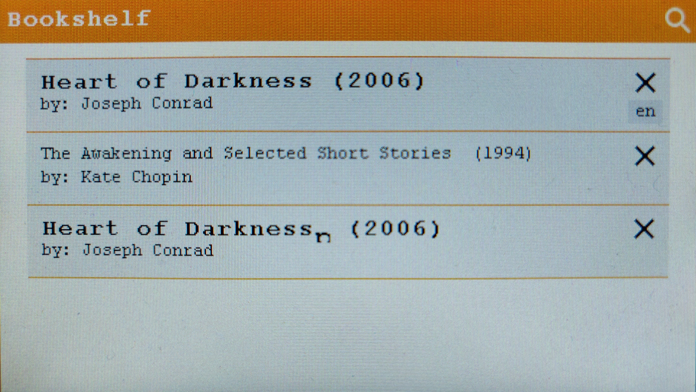

# Bibliothèque

La bibliothèque de livres permet d'accéder à ses livres téléchargés et de les ouvrir dans le lectur numérique. Les fichiers sont stockés sur la carte SD au format *.txt* avec une en-tête contenant de nombreuses métadonnées comme le genre, la langue, le nom de l'auteur ou le titre du livre. Passée cette en-tête se trouve le livre et enfin quelques informations statistiques sur la fin.

Les pages qui suivent expliquent la configuration de la carte SD ainsi que le travail réalisé sur l'UI/UX et la structure objet qui décrivent les livres.